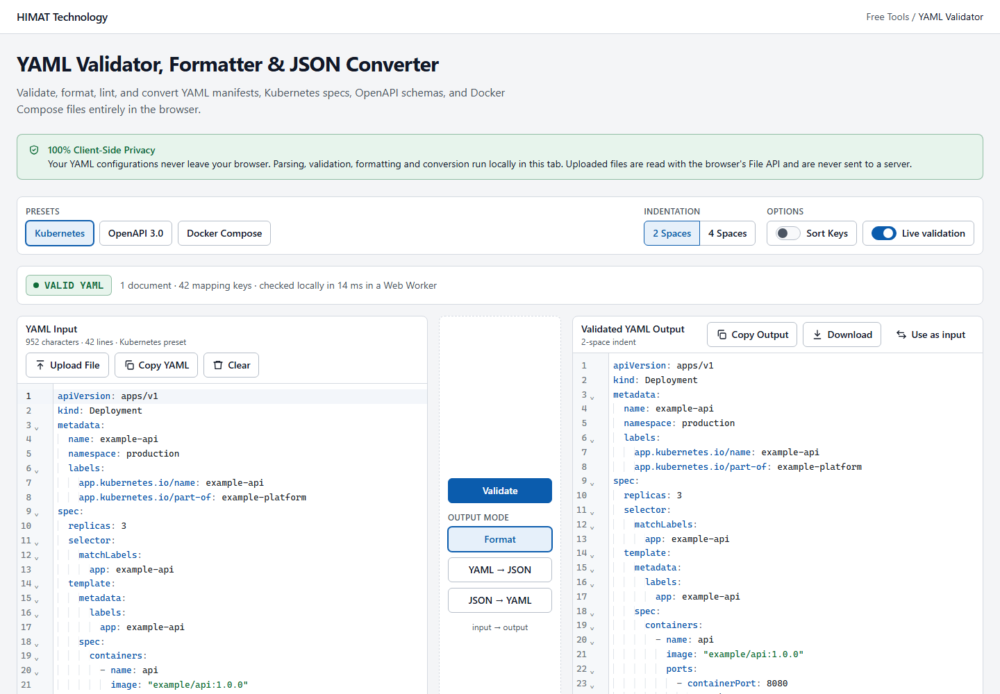
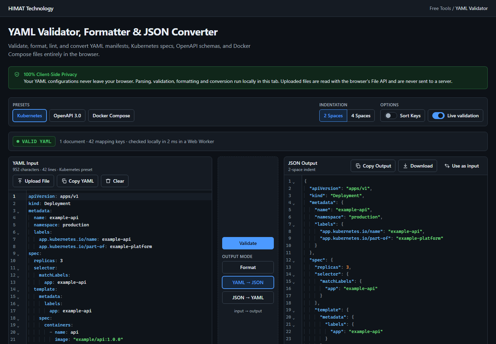
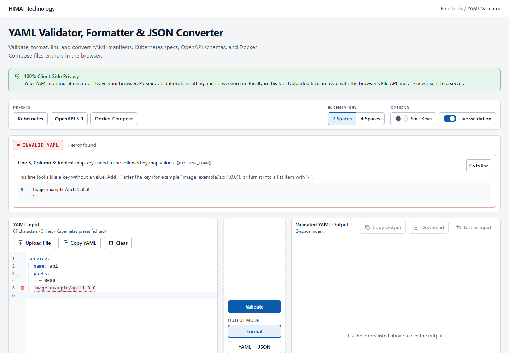
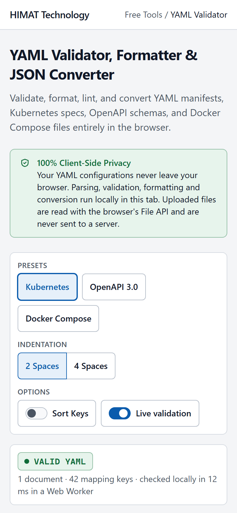
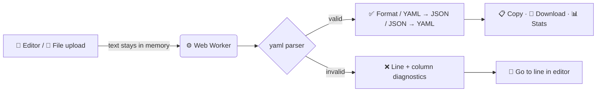

<div align="center">


### Validate, format, lint and convert YAML manifests, Kubernetes specs, OpenAPI schemas and Docker Compose files. Everything runs in your browser.

<a href="https://himat.tech/free-tools/yaml-validator">
  
</a>

<br /><br />


<br />

**[Live Demo](https://himat.tech/free-tools/yaml-validator)** &nbsp;•&nbsp;
**[Features](#-features)** &nbsp;•&nbsp;
**[Screenshots](#-screenshots)** &nbsp;•&nbsp;
**[Quick Start](#-quick-start)** &nbsp;•&nbsp;
**[Architecture](#-architecture)** &nbsp;•&nbsp;
**[Contact](#-contact-himat-technology)**

</div>

---

## 🔒 100% Client-Side Privacy

> [!IMPORTANT]
> **Your YAML configurations never leave your browser.**
> All parsing, validation, formatting and conversion happen locally, usually inside a Web Worker. The app has no API routes, database, analytics or telemetry. Uploaded files are read with the browser's File API and are never sent to a server.

---

## ✨ Features

<table>
  <tr>
    <td width="50%" valign="top">

### ✅ Real validation
- **VALID / INVALID** status for YAML and JSON
- Real **line and column** positions reported by the parser
- A hint, a source excerpt with a caret, a red underline in the editor and a **Go to line** button for each error
- Catches duplicate keys, tabs, bad indentation, unterminated quotes, missing colons, invalid sequences, unresolved aliases and "billion laughs" alias bombs

</td>
    <td width="50%" valign="top">

### 🔁 Convert & format
- **Format YAML** keeps comments, anchors and block scalars
- **YAML → JSON** turns multi-document streams into a JSON array
- **JSON → YAML** quotes values such as `"yes"` and `"1.0"` so their types survive
- Big integers stay exact, and there's no silent float rounding
- Choose **2 or 4 spaces** of indentation

</td>
  </tr>
  <tr>
    <td width="50%" valign="top">

### 🔤 Sort Keys (opt-in)
- Recursive **A → Z** key sorting
- Array order is never changed
- A **"Keys sorted A→Z"** badge marks sorted output

</td>
    <td width="50%" valign="top">

### ⚠️ Smart warnings
- Unquoted YAML 1.1 booleans (`yes`, `on`, `off`, …)
- Unknown custom tags (`!Ref`, `!include`)
- Duplicate keys in JSON

</td>
  </tr>
  <tr>
    <td width="50%" valign="top">

### 📝 Pro editor
- CodeMirror 6 with line numbers, syntax colours and indentation guides
- Live character and line counts
- **Copy**, **Clear**, `Ctrl/Cmd + Enter` to validate
- Stays responsive with multi-MB documents

</td>
    <td width="50%" valign="top">

### 📂 Upload, copy & download
- Accepts `.yaml`, `.yml` and `.json` files (up to 20 MB), read locally with `File.text()`
- JSON uploads switch the tool to **JSON → YAML** automatically
- **Copy YAML / Copy JSON / Copy Output** buttons show "Copied!" on success
- Downloads are named `validated.yaml` or `converted.json`

</td>
  </tr>
  <tr>
    <td width="50%" valign="top">

### 🚀 Presets
- ☸️ Kubernetes Deployment
- 📘 OpenAPI 3.0
- 🐳 Docker Compose

All presets use placeholder values only.

</td>
    <td width="50%" valign="top">

### 📊 Live statistics
- Payload size (UTF-8 bytes)
- Lines, characters and mapping keys
- Document count and output size
- Light and dark themes, a responsive layout and accessible keyboard/screen-reader support

</td>
  </tr>
</table>

---

## 📸 Screenshots

<div align="center">

| ☀️ Light mode | 🌙 Dark mode · YAML → JSON |
| :---: | :---: |
|  |  |
| **❌ Precise error diagnostics** | **📱 Mobile** |
|  |  |

</div>

---

## ⚡ Quick Start

> Requires **Node.js 20.9+** (developed on Node 24).

```bash
# 1. Install dependencies
npm install

# 2. Start the dev server
npm run dev
```

Then open **<http://localhost:3000/free-tools/yaml-validator>**. The root URL `/` redirects there.

### 🧰 Scripts

| Command | What it does |
| --- | --- |
| 🟢 `npm run dev` | Development server (Turbopack) |
| 🏗️ `npm run build` | Production build |
| 🚀 `npm run start` | Serve the production build |
| 🧹 `npm run lint` | ESLint (Next.js core-web-vitals + TypeScript) |
| 🔎 `npm run typecheck` | Generate route types + `tsc --noEmit` |
| 🧪 `npm run test` | Vitest unit tests for the processing library |
| 🎭 `npm run test:e2e` | Playwright browser tests against a production build (port 3100) |

> [!TIP]
> Before the first E2E run, install the browser with `npx playwright install chromium`. If you've already built the app, set `E2E_SKIP_BUILD=1` to skip the rebuild.

---

## 🏛️ Architecture

```text
src/
├─ app/
│  ├─ layout.tsx                          Root layout + default metadata
│  └─ free-tools/yaml-validator/page.tsx  Tool page: SEO metadata, JSON-LD, FAQ
├─ components/yaml-validator/
│  ├─ YamlValidatorTool.tsx               Client orchestrator (state, debounced processing)
│  ├─ YamlEditor.tsx · OutputViewer.tsx   Input and output panels
│  ├─ CodeEditor.tsx · codemirror-setup.ts  CodeMirror wrapper, theme, diagnostics
│  ├─ ValidationStatus.tsx                Status badge + diagnostics list
│  └─ ActionButtons · ConversionControls · PresetSelector · FileUploader
│     CopyButton · ToolStats · PrivacyNotice · ToolInfoSections
├─ hooks/useYamlProcessor.ts              Owns the Web Worker client
├─ workers/yaml.worker.ts                 Runs processing off the main thread
└─ lib/
   ├─ yaml-parser.ts                      parseAllDocuments → diagnostics, key counts
   ├─ yaml-formatter.ts                   Format YAML + YAML 1.1 boolean lint
   ├─ yaml-converter.ts                   YAML ⇄ JSON with exact big integers
   ├─ json-diagnostics.ts                 Locates JSON syntax errors / duplicate keys
   ├─ key-sort.ts                         Recursive key sorting (arrays untouched)
   ├─ processor.ts · processor-client.ts  Entry point, worker lifecycle, fallback
   └─ text-stats · file-utils · clipboard-utils · download-utils · presets
e2e/yaml-validator.spec.ts                Playwright tests
```



The worker is created with `new Worker(new URL("../workers/yaml.worker.ts", import.meta.url))`. If a worker can't start, the same `processInput` function runs on the main thread. When a new request arrives while the worker is still busy, the worker is terminated and a fresh one handles the new request, so a slow document can't block newer input.

---

## 🛡️ Security

- 🚫 The app has no server routes. The only network traffic is the same-origin download of the app's own JS and CSS.
- 🧱 Production responses send a **Content-Security-Policy** with `connect-src 'self'` and `form-action 'none'`, as well as `X-Frame-Options: DENY`, `Referrer-Policy: no-referrer` and `nosniff`.
- 🔍 The E2E suite checks the following:
  - no request goes to a foreign origin;
  - no non-GET request is made;
  - an uploaded secret never appears in any request.
- 🤫 The parser library is configured never to print warnings (which can quote document content) to the console.
- ♿ The E2E suite runs an axe-core accessibility scan (WCAG 2.2 AA) in light and dark mode.
- 🔑 Presets use placeholder hostnames and credentials only.

---

## 📌 Known Limitations

- **Formatting may rewrite number notation.** The `yaml` library normalizes numbers when it re-emits them: `0x1F` → `0x1f`, `+12` → `12`, `1e3` → `1e+3`. Values stay the same.
- **YAML → JSON drops comments.** JSON cannot hold them.
- **Integer-like keys are reordered in JSON.** JavaScript engines put keys such as `"10"` first in objects, so they appear first in JSON output.
- **Custom tags become strings.** Values with custom tags (`!Ref`, `!include`) are kept as plain strings and a warning is shown.
- **Live validation pauses above ~1 MB.** Click **Validate** (or press `Ctrl/Cmd + Enter`) to process large inputs. Uploads are limited to 20 MB.
- **Sort Keys moves anchor definitions.** When sorting would put an alias before its anchor, the definition (`&name`) moves to the first place it's used, so the data stays identical. Documents that reuse the same anchor name can't be sorted, and the tool explains why.
- **Extremely deep nesting is rejected.** YAML nested roughly 1,000 levels deep (JSON a few thousand) exceeds the browser's stack and gets a clear "nested too deeply" error instead of a crash.
- **The CSP headers are production-only.** They are not sent by `npm run dev`.
- **Browser testing has been limited.** The E2E tests have only been run in Chromium on Windows.

---

## 📬 Contact HIMAT Technology

<div align="center">

<a href="https://himat.co.in"></a>
<a href="https://himat.tech/free-tools/yaml-validator"></a>
<a href="mailto:info@himat.co.in"></a>
<a href="tel:+919445234023"></a>

<a href="https://www.linkedin.com/company/himat-technology"></a>
<a href="https://www.instagram.com/himat_technology"></a>
<a href="https://www.facebook.com/people/Himat-technology/61593829197445/"></a>

<br /><br />

| | Channel | Link |
| :---: | --- | --- |
| 🌐 | Website | [himat.co.in](https://himat.co.in) |
| 🚀 | Live demo | [himat.tech/free-tools/yaml-validator](https://himat.tech/free-tools/yaml-validator) |
| ✉️ | Email | [info@himat.co.in](mailto:info@himat.co.in) |
| 📞 | Phone | [+91 94452 34023](tel:+919445234023) |
| 💼 | LinkedIn | [linkedin.com/company/himat-technology](https://www.linkedin.com/company/himat-technology) |
| 📸 | Instagram | [@himat_technology](https://www.instagram.com/himat_technology) |
| 👍 | Facebook | [Himat Technology](https://www.facebook.com/people/Himat-technology/61593829197445/) |

<br />

**Built with ❤️ by [HIMAT Technology](https://himat.co.in)**


</div>
